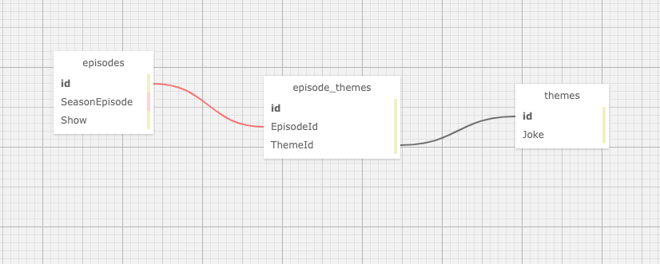

# Larry vs Jerry

#### C# two day project for Epicodus to practice Many-to-Many relationships, 1.7.2020

#### By Bess Campbell and Taylor Delph

## Description

 A real Larry vs Jerry battle for which show has the most overlapping themes between episodes. Match episodes from either Seinfeld or Curb Your Enthusiasm with themes/jokes that you have found in either show. This website will demonstrate how many-to-many relationships are able to connect many episodes with many different themes using a join table.


## Prerequisites

### Software Requirements

• A browser like [Chrome](https://www.google.com/chrome/)

• A code editor like [VSCode](https://code.visualstudio.com/download)

• With [.NET Core 2.2](https://dotnet.microsoft.com/download/dotnet-core/thank-you/sdk-2.2.106-macos-x64-installer) installed

• [MySQL](https://dev.mysql.com/downloads/file/?id=484914) **Instructions for setup below**

• [MySQL Workbench](https://dev.mysql.com/downloads/file/?id=484391)

#### MySQL & MySQL Workbench Setup instructions

* Download the [MySQL Community Server](https://dev.mysql.com/downloads/file/?id=484914). Click the 'No thanks, just start my download' link.
* Follow along with the installer until you reach the Configuration page. Then select the following options:
  * Use Legacy Password Encryption.
  * Set password to **epicodus** or to your own personlized password.
  * Click Finish.

* Open the terminal and enter the command `echo 'export PATH="/usr/local/mysql//bin:$PATH"'>>~/.bash_profile`
* Type `source ~/.bash_profile` in the terminal to verify that MySQL was installed.
* Enter `mysql -uroot -pepicodus` or `mysql -uroot -p{your_password}` in the terminal to verify the installation. You will know it's installed when you gain access to the `mysql>` command line.
* Download the [MySQL Workbench](https://dev.mysql.com/downloads/file/?id=484391) file using the 'No thanks, just start my download' link.
* Install MySQL Workbench in the Applications folder.
* Open MySQL Workbench and select the `Local instance 3306` server. You will need to enter the password **epicodus** (or the password you set). 

#### Setup and Use (cloning)

 * Open your terminal and ensure you are within the directory you'd like the file to be created in.
 * Enter the following command `$ git clone https://github.com/besscampbell/LarryDavid.git`
 * Once cloned, use the `$ cd LarryDavid.Solution/LarryDavid` command to navigate to the project directory.
 * Enter `$ dotnet restore`

#### Import database with Entity Framework Core
* Now enter `$ dotnet ef database update` to create database in MySQL.
* To run the console application, enter `$ dotnet run`
* Your command line will open a server (likely `http://localhost:5000/`). Navigate to this URL in your browser to view the project.

#### Import Database with MySQL Workbench
* In the top toolbar of MySQL Workbench, click on `Server -> Data Import`.
* Select option for `Import from Self-Contained File`.
* Set the `Default Target Schema` or create a new schema.
* Select Schema Objects you wish to import.
* Ensure the option `Dump Structure and Data` is selected (located near the bottom).
* Click `Start Import`

#### Import Database with SQL Schema
* Open MySql Workbench and paste the following Schema Create Statement into a new SQL tab for executing queries.
```
CREATE DATABASE `larry_david` /*!40100 DEFAULT CHARACTER SET utf8mb4 COLLATE utf8mb4_0900_ai_ci */;
USE larry_david;

DROP TABLE IF EXISTS `__EFMigrationsHistory`;
CREATE TABLE `__EFMigrationsHistory` (
  `MigrationId` varchar(95) NOT NULL,
  `ProductVersion` varchar(32) NOT NULL,
  PRIMARY KEY (`MigrationId`)
) ENGINE=InnoDB DEFAULT CHARSET=utf8mb4 COLLATE=utf8mb4_0900_ai_ci;

DROP TABLE IF EXISTS `Episodes`;
CREATE TABLE `Episodes` (
  `EpisodeId` int(11) NOT NULL AUTO_INCREMENT,
  `Show` longtext,
  `SeasonEpisode` longtext,
  PRIMARY KEY (`EpisodeId`)
) ENGINE=InnoDB AUTO_INCREMENT=5 DEFAULT CHARSET=utf8mb4 COLLATE=utf8mb4_0900_ai_ci;

DROP TABLE IF EXISTS `EpisodeTheme`;
CREATE TABLE `EpisodeTheme` (
  `EpisodeThemeId` int(11) NOT NULL AUTO_INCREMENT,
  `EpisodeId` int(11) NOT NULL,
  `ThemeId` int(11) NOT NULL,
  PRIMARY KEY (`EpisodeThemeId`),
  KEY `IX_EpisodeTheme_EpisodeId` (`EpisodeId`),
  KEY `IX_EpisodeTheme_ThemeId` (`ThemeId`),
  CONSTRAINT `FK_EpisodeTheme_Episodes_EpisodeId` FOREIGN KEY (`EpisodeId`) REFERENCES `episodes` (`EpisodeId`) ON DELETE CASCADE,
  CONSTRAINT `FK_EpisodeTheme_Themes_ThemeId` FOREIGN KEY (`ThemeId`) REFERENCES `themes` (`ThemeId`) ON DELETE CASCADE
) ENGINE=InnoDB AUTO_INCREMENT=11 DEFAULT CHARSET=utf8mb4 COLLATE=utf8mb4_0900_ai_ci;

DROP TABLE IF EXISTS `Themes`;
CREATE TABLE `Themes` (
  `ThemeId` int(11) NOT NULL AUTO_INCREMENT,
  `Joke` longtext,
  PRIMARY KEY (`ThemeId`)
) ENGINE=InnoDB AUTO_INCREMENT=6 DEFAULT CHARSET=utf8mb4 COLLATE=utf8mb4_0900_ai_ci;

```
#### SQL Database Design



## Technologies Used

_This application required use of the following programs/languages/libraries to create:_
* _GitBash_
* _Visual Studio Code_
* _GitHub_
* _C# v 7.3_
* _.NET Core v 2.2_
* _MSTest_
* _ASP.NET Core MVC_
* _Bootstrap_
* _CSS_
* _cshtml_
* _MySQL Workbench_
* _Entity Framework Core_
* _[SQL Designer](https://ondras.zarovi.cz/sql/demo/)_

## Known Bugs

No known bugs.

## Support and contact details

Feel free to contact <bess.k.campbell@gmail.com> and <taylulzcode@gmail.com>

## License

MIT_ Copyright (c) 2020 *_Bess Campbell & Taylor Delph_*